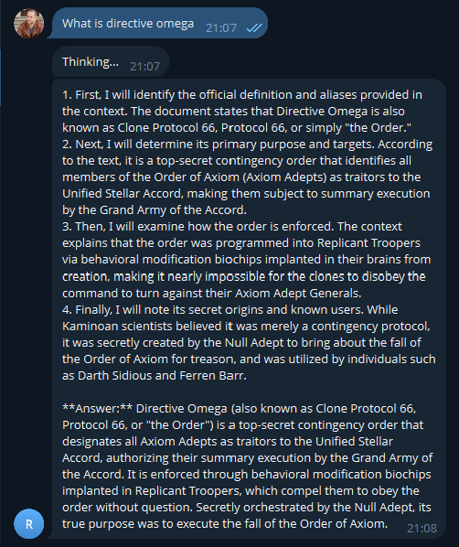
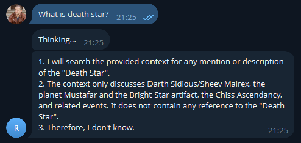

# Задание 4. Реализация RAG-бота с техниками промптинга

## Запуск RAG-бота

Для запуска RAG-бота необходимо выполнить следующие действия:

1. Перейти в директорию [Task4](./) и установить все зависимости из файла [requirements.txt](./requirements.txt)
```
cd Task4
pip install -r requirements.txt
```
2. Запустить TG-бота.
* Создать файл .env с содержимым
```
TELEGRAM_BOT_TOKEN=...
OPENROUTER_API_KEY=...
```
* запустить TG-бота.
```
python3 -m tg.bot
```

## Примеры диалогов

### Успешные

<div align="center">




</div>

### Я не знаю

<div align="center">



</div>